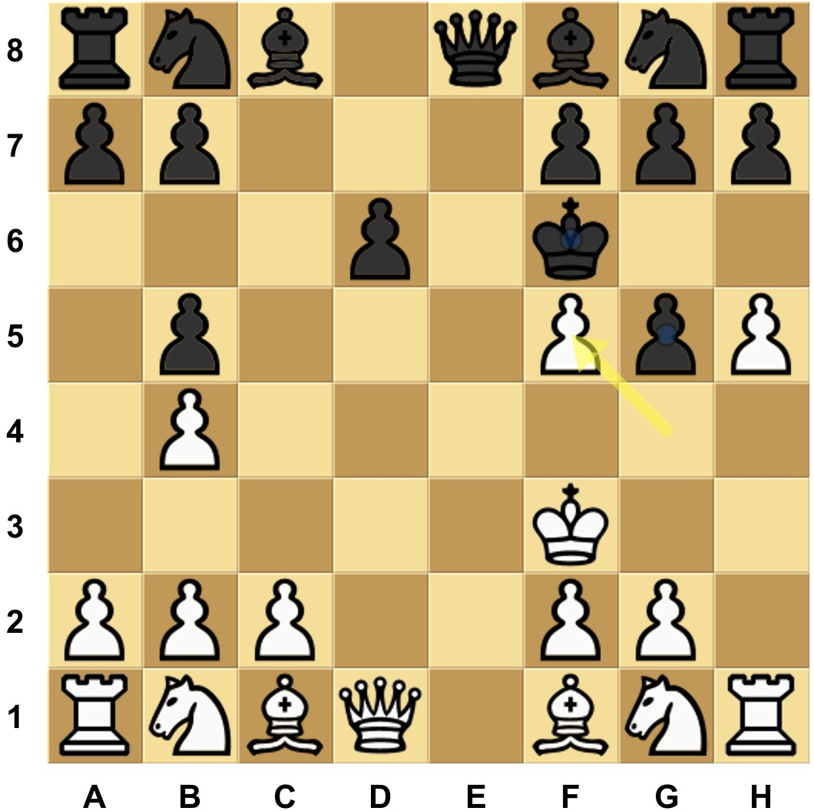

# 现代战争棋（Modern Warfare Chess, MWChess）：  一种全新主题的国际象棋变体设计

本文提出一种全新的国际象棋变体 —— MWChess，旨在剥离传统国际象棋所承载的中世纪战争背景，转而体现当代军事体系与政治博弈的复杂性。在这一设定中，玩家将不再扮演古代王国的君主或将领，而是指挥现代意义下的作战单位、火力打击系统、战略部署与后勤保障。与此同时，政治权谋、信息控制、地缘布局等非传统军事要素也被纳入了游戏机制。玩家无需完全熟悉经典国际象棋的规则，便可学习和上手本变体。

其设计理念是在保留部分经典要素的基础上，构建一套适合新时代战略思维的对弈系统，激发对现代战争形态与博弈结构的深入思考。

---

## 目录
- [1. 现代战争棋（MWChess）设计宗旨](#1-现代战争棋mwchess设计宗旨)
- [2. 棋盘与初始布局](#2-棋盘与初始布局)
- [3. 棋子规则与象征意义](#3-棋子规则与象征意义)
  - [3.1 王（King）](#31-王king)
  - [3.2 兵（Pawn）](#32-兵pawn)
  - [3.3 车（Rook）](#33-车rook)
  - [3.4 相（Bishop）](#34-相bishop)
  - [3.5 马（Knight）](#35-马knight)
  - [3.1 后（Queen）](#36-后queen)
- [4. 胜负条件](#4-胜负条件)
- [5. 策略建议](#5-策略建议)

---

## 1. 现代战争棋（MWChess）设计宗旨

MWChess 的设计理念，是在保留经典国际象棋核心框架的基础上，融入现代战争中的战略思想与政治博弈机制，力图在规则与机制层面抽象出当代军事对抗的核心特征，以此激发玩家对现代战争形态及其博弈机制的系统性理解与思辨。具体设计目标如下：

- ### 保持与经典国际象棋一致的棋盘与棋子

  MWChess 采用与经典国际象棋完全一致的 8×8 棋盘与标准棋子类型，无需额外设备或特殊组件。这一设计选择降低了玩家的入门门槛，提高了游戏的可接入性与传播便捷性。只要拥有一套普通的国际象棋，即可尝试 MWChess，从而最大程度地方便了该变体的普及。

- ### 保持规则的简洁性与决策的深度

  MWChess 力求在规则复杂度上与经典国际象棋保持一致，使游戏具备清晰、易学的特点，同时在策略层面仍保留足够的思考深度空间。游戏规则直观明了，便于初学者快速上手；但在战术调度、单位协同与利益博弈等方面又富含深度，能够吸引进阶玩家持续探索。这种“易学难精”的结构，有助于建立长久的可玩性与竞技价值。

- ### 保持快节奏的对抗体验

  MWChess 保留了经典国际象棋中部分棋子具备大范围机动能力的特点，使棋子在开局阶段便拥有多样的落点选择与进攻路径。这一设计增强了战术多样性与对局的不确定性，同时，有助于对弈更快进入中盘阶段的高强度博弈。

- ### 保持良好操作体验

  经典国际象棋的“吃子”机制（将己方棋子移动至对方所在格，并提走被吃的棋子），为游戏带来了直接、具象、甚至略带“暴力美学”的操作感，这是其广受喜爱的原因之一。尽管游戏背景为现代战争（即热兵器主导的作战形式），MWChess依然通设计刻意保留了“进入目标格子、当面击毁敌方棋子”的操作方式——不设远程消灭机制。这种选择一方面保持了国际象棋原有的操作直觉，另一方面也确保了了对局的观赏性和操作体验

- ### 抽象且充分地反映现代战争的特征

  现代战争不同于古代的方阵对抗，各作战单位之间的协同配合与分工协作尤为关键。除了经典的装甲与弹药对抗，现代战争中的“信火协同打击”也提供了不同维度的杀伤方式，使得战场态势更加复杂。与此同时，作战双方在战争中的政治影响力博弈也扮演着极其重要的角色，往往能左右整个战争的走向。MWChess 旨在将这些现代战争的关键概念抽象并融入棋局之中，并希望在军事教育与国防认知普及方面，发挥积极作用。

---

## 2. 棋盘与初始布局

MWChess 的棋盘尺寸、所使用的棋子类型，以及初始布局，均与经典国际象棋完全一致。

黑白双方各拥有以下棋子组合：
- 8 个 ***兵（Pawns）***
- 2 个 ***车（Rooks）***
- 2 个 ***马（Knights）***
- 2 个 ***象（Bishops）***
- 1 个 ***后（Queen）***
- 1 个 ***王（King）***

白方布局如下：
- ***兵*** ：位于 ***a2*** 至 ***h2***
- ***车*** ：位于 ***a1*** 和 ***h1***
- ***马*** ：位于 ***b1*** 和 ***g1***
- ***象*** ：位于 ***c1*** 和 ***f1***
- ***后*** ：位于 ***d1***
- ***王*** ：位于 ***e1***

黑方布局如下：
- ***兵*** ：位于 ***a7*** 至 ***h7***
- ***车*** ：位于 ***a8*** 和 ***h8***
- ***马*** ：位于 ***b8*** 和 ***g8***
- ***象*** ：位于 ***c8*** 和 ***f8***
- ***后*** ：位于 ***d8***
- ***王*** ：位于 ***e8***

如图：

---

## 3. 棋子规则与象征意义

### 3.1 ***王（King）***
  #### 行动规则：
  - ***王*** 可以向任意方向（前、后、左、右及四个对角方向）移动一格。
  
  - 若目标位置上存在敌方棋子，则可吃子并占据该格。
  
  - ***王*** ***不可*** 被牺牲：任何行动不得导致行动结束后，己方 ***王*** 处于敌方棋子可吃的位置（即”被将“状态，或 ***Checked***）。
  
  #### 示例：
  
  下图中，位于 ***f4*** 的白 ***王*** 可以移动至任一红点位置，并可吃掉位于 ***e5*** 的黑 ***车***，但无法进入 ***f5*** 和 ***g5***，因为这两个格子受到位于 ***g6*** 的黑 ***王*** 的威胁。
  
  

  
  

  #### 象征意义：
  在 MWChess 中，***王*** 不仅代表最高指挥官，也象征着一方势力的最后防线与核心意志。其安全直接决定整场战争的胜负。

### 3.2 ***兵（Pawn）***
  #### 行动规则：
  - ***兵*** 可以向前方、左前方、右前方、左侧或右侧移动一格，不可向后方、左后方或右后方移动。
  
  - 若目标位置上存在敌方棋子，则可吃子并占据该格。
  
  - ***初始移动*** ：***兵*** 在首次移动时，可选择向前方、左前方、右前方、左侧或右侧方向连续移动两格，前提是这两格都是空格。注意，该连续两格移动 ***不能*** 用于吃子。
  
  - ***压制*** ：***兵*** 仅在处于“压制”状态下方可被敌方吃子。***压制*** 指的是 ***兵*** 所在格周围八格中至少存在两个敌方棋子。
  
  #### 示例：
  
  下图中，位于 ***f2*** 的白 ***兵*** 处于其初始位置，因此可以沿允许的方向移动一或两格，达到任一红点位置（如 ***d2*** 或 ***h2*** ）。白 ***兵*** 可以吃掉位于 ***f3*** 的黑 ***兵***，因为该黑 ***兵*** 被位于 ***e4*** 和 ***f2*** 的白 ***兵*** 所压制，但无法吃掉位于 ***g3*** 的黑 ***兵*** ，因为该黑 ***兵*** 未被压制。位于 ***d4*** 的黑 ***兵*** 虽然被位于 ***c4*** 和 ***e4*** 的白 ***兵*** 压制，但位于 ***f2*** 的白 ***兵*** 不能吃它，因为根据 ***兵*** 的初始移动规则，连续两格移动时不能吃子。
  
  

  
  

  #### 象征意义：
  ***兵*** 象征现代战争中的主力作战单位，具备较强的机动性与区域控制能力。相比经典国际象棋，MWChess 中的 ***兵*** 更为强大，应作为中坚力量，在前线承担关键战略任务。“压制”规则体现了现代主力部队在非集中火力下的生存能力。

### 3.3 ***车（Rook）***
  #### 行动规则：
  - ***车*** 可沿左前、右前、左后、右后四个对角方向直线移动任意距离，前提是路径未被阻挡。
  
  - ***车*** ***不能*** 通过移动吃子，即只能移动到空格内。
  
  - 同方 ***相*** 的部署需依赖 ***车*** 的位置， ***车*** 所在的行或列决定相的可部署区域。
  
  #### 示例：
  
  下图中，位于 ***d4*** 的白 ***车*** 可沿对角线方向移动至任一红点位置。由于 ***车*** 不能吃子，因此黑 ***王*** 在上一步能够安全地从 ***b7*** 移动至 ***b6***。
  
  

  
  

  #### 象征意义：
  - ***车*** 代表现代战争中的电子侦察与辅助设施，如雷达、卫星、通信节点等。虽然自身不具备直接攻坚能力，但却是现代战场决策与打击体系的重要组成部分。其高机动性与“不能吃子”的设定，体现了电子设施的隐蔽性与非战斗性。

### 3.4 ***相（Bishop）***
  #### 行动规则：
  - ***相*** 有两种行动方式：

    - 可被移动至与己方任意一个 ***车*** 处于同一行或列的任一空格处；
    
    - 可对其周围八格中的任意一个敌方棋子执行吃子操作，并占据该棋子原先所在的格子。

  - ***相*** ***不可*** 被吃。

  - ***相*** 的吃子行为不受“ ***兵*** 需被压制才能被吃”或“ ***相*** 不可被吃”的规则限制。即，***相*** 可以吃敌方的 ***相*** 和未被压制的 ***兵***。

  #### 示例：
  
  下图中，白方位于 ***e4*** 和 ***h1*** 的 ***车*** 所在的 ***行*** 和 ***列*** 决定了位于 ***h5*** 和 ***c1*** 的 ***相*** 可以移动至任一红点位置。额外地，位于 ***h5*** 的 ***相*** 可以通过吃掉位于 ***g6*** 的黑 ***相*** 和未被压制的位于 ***g5*** 的黑 ***兵***，进入它们所在的格子。
  
  

  
  

  #### 象征意义：
  - ***相*** 象征现代战争中的空天打击力量，其打击方式依赖地面侦察与引导（即 ***车*** ）。它体现了“侦察-锁定-打击”的信火一体化作战体系。“ ***相*** 不可被吃”的设定体现了高空打击一旦展开便几乎不可逆的作战特性。

### 3.5 ***马（Knight）***
  #### 行动规则：
  - ***马*** 可沿前、后、左、右四个直线方向移动任意距离，前提是路径未被阻挡。
  
  - 若目标位置上存在敌方棋子，则吃子并占据该格。

  - ***马*** 的吃子行为不受“ ***兵*** 需被压制才能被吃”或“ ***相*** 不可被吃”的规则限制。

  - （注：其行动规则与经典国际象棋中的 ***车*** 一致，仅名称沿用 ***马***。）
  
  #### 示例：
  
  下图中，位于 ***e4*** 的白 ***马*** 可以移动至横向和纵向上的任一红点位置。白 ***马*** 可以吃掉位于 ***h4*** 的黑 ***相*** 和未被压制的位于 ***e6*** 的黑 ***兵***。此外，如果白 ***马*** 吃掉位于 ***e6*** 的黑 ***兵***，则会对位于 ***e8*** 的黑 ***王*** 形成将军（***Check***）。
  
  

  
  

  #### 象征意义：
  - ***马*** 代表现代战争中的特种作战部队，具备高机动性与高破坏力。他们可精准打击关键目标，无论是前线作战单位、远程打击设施，还是战略层级的政治目标，皆在其打击范围之内。

### 3.6 ***后（Queen）***
  #### 行动规则：
  - ***后*** 可沿任意方向（前、后、左、右及四个对角方向）直线移动任意距离，前提是路径未被阻挡。
  - ***后*** ***不能*** 通过移动吃子，即只能移动到空格内。
  - 后具有特殊的游戏胜利条件：当我方的 ***后*** 成功到达对方底线任意一格（白方底线为行 ***1***；黑方底线为行 ***8***），则我方胜利。

  #### 示例：
  
  下图中，位于 ***c4*** 的白 ***后*** 可以移动至任一红点位置。特别地，如果白 ***后*** 移动至 ***g8***（黑方底线，行 ***8***），则白方获胜。
  
  

  
  

  #### 象征意义：
  ***后*** 代表现代战争中的“非直接军事力量”——即政治、外交、舆论等地缘政治工具。虽不直接参与战场打击，但在整体战略布局中具有决定性影响。其高自由度的移动方式象征政治力量在多维空间中活动的灵活性与广泛渗透力。
  
---

## 4. 胜负条件

### ***将死（Checkmate）***

若我方的一步棋使得对方的 ***王*** 处于“被将”状态，且对方在下一步无法使王脱离“被将”的状态，则我方胜利。

### ***后至底线（PoliWin）***

当我方的 ***后*** 成功到达对方底线任意一格（白方底线为行 ***1***；黑方底线为行 ***8***），且我方 ***king*** 未处于“被将“状态，则我方胜利。

### ***和棋（Draw）***
  - 可以由一方提出，另一方接受而和棋；
  - 若某一方无任何合法走法，且其 ***王*** 未处于“被将”状态，则为和棋；
  - 若相同的走子局面连续出现三次（即 ***三次重复局面*** ），则为和棋；
  - 若双方最近的50步棋均未吃子，则和棋。

### 特别说明
***PoliWin*** 的优先级低于 ***Check*** 和 ***Checkmate***。

即使我方下一步可以通过 ***后*** 抵达敌方底线实现 ***PoliWin***，但如果我方的 ***王*** 已在对方上一回合被 ***Check***，则我方必须优先接触 ***Check***，如果是 ***Checkmate*** 则对方直接获胜。

下图中，虽然位于 ***e8*** 的黑 ***后*** 可以通过移动至 ***e1***（白方底线，行 ***1***）实现 ***PoliWin*** 胜利，但由于上一回合白方将位于 ***g4*** 的 ***兵*** 移动至 ***f5*** 对位于 ***f6*** 的黑 ***王*** 形成将军（Check），黑方必须先应对将军。因此，黑方只能通过使用位于 ***g5*** 的黑 ***兵*** 或位于 ***f6*** 的黑 ***王*** 吃掉被压制的位于 ***f5*** 的白 ***兵***，或将黑 ***王*** 移动至 ***e7*** 来解除将军。

---

## 5. 策略建议

- ***王***

  ***王*** 具备实质战斗能力，因此在游戏中后期不应一味被动防守，可在局势允许时主动出击，压迫对方布局。

- ***兵***

  ***兵*** 具备良好的控制能力与抗压能力，适合稳固前场与中场区域。然而，***兵*** 无法后撤，且越接近敌方底线，其活动空间越受限制，因此应避免过早推进至敌方底线。

- ***车***

  ***车*** 决定了 ***相*** 的部署范围，合理运用其长距离移动能力，有助于将 ***相*** 部署到关键位置。但 ***车*** 本身无法吃子，缺乏自保能力，应避免深入敌后或孤立。

- ***相***

  尽管 ***相*** 的位置高度依赖 ***车*** 的部署，但其本身可通过吃子方式实现移动。因此，玩家应时刻留意利用敌方棋子作为跳板的机会，将 ***相*** 调动至敌人意想不到的位置，形成威胁，而不是由于失去己方的 ***车*** 导致 ***相*** 无法移动。
  
- ***马***

  ***马*** 具有极高的战略价值，可无视“ ***兵*** 需被压制才能被吃”或“ ***相*** 不可被吃”的规则，自由攻击敌方关键单位。应在游戏前中期优先调动，主动出击，特别是在压制对方 ***后*** 或 ***相*** 时发挥关键作用。

- ***后***

  ***后*** 虽无法吃子，但其通行能力强、胜负影响极大，应在中后期伺机而动，寻找一击致胜的 ***PoliWin*** 机会。前期应重点保护己方 ***后*** 的安全，并寻找时机围歼对方 ***后***，以获得战略主动权。

---

© 2025 原作者版权所有。  
本规则集采用“知识共享署名-非商业性使用 4.0 国际许可协议”（CC BY-NC 4.0）许可。
您可以在遵守署名要求的前提下，自由复制、传播及修改本规则内容，但不得将其用于商业目的。
许可协议详情请见：https://creativecommons.org/licenses/by-nc/4.0/
