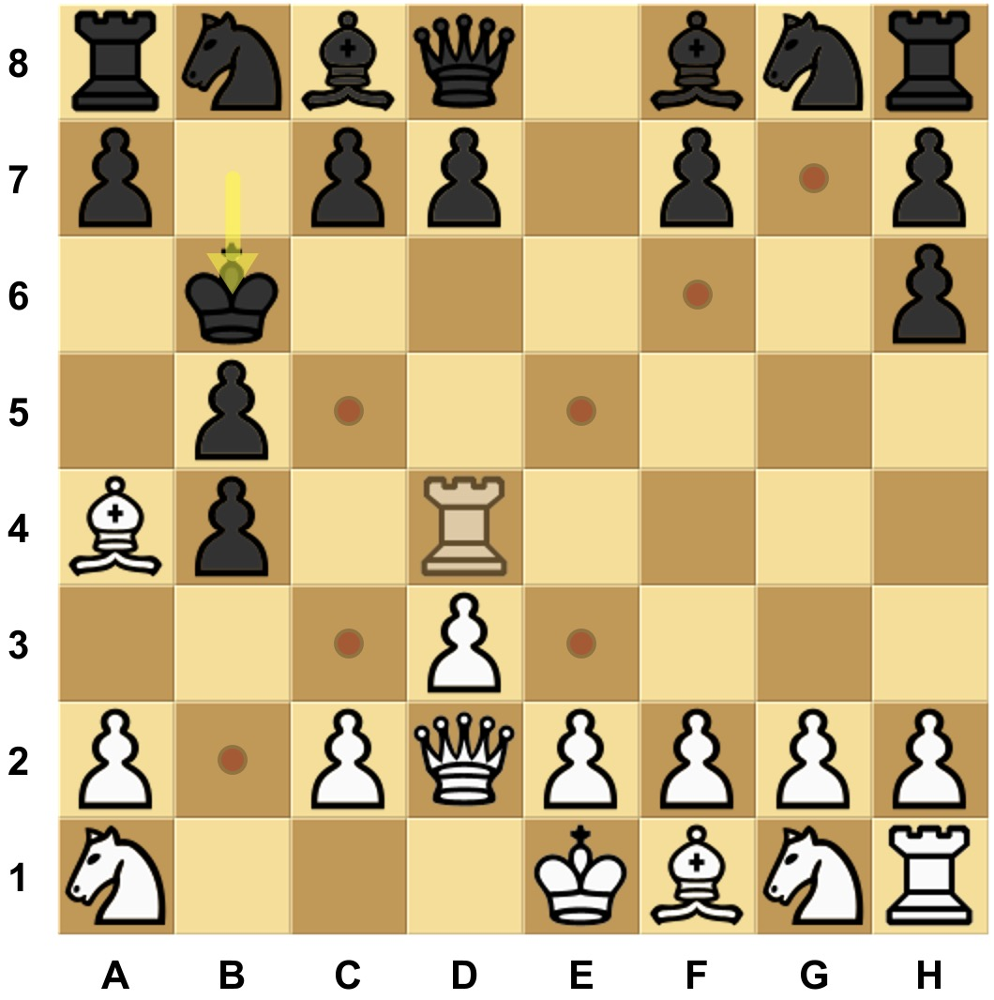
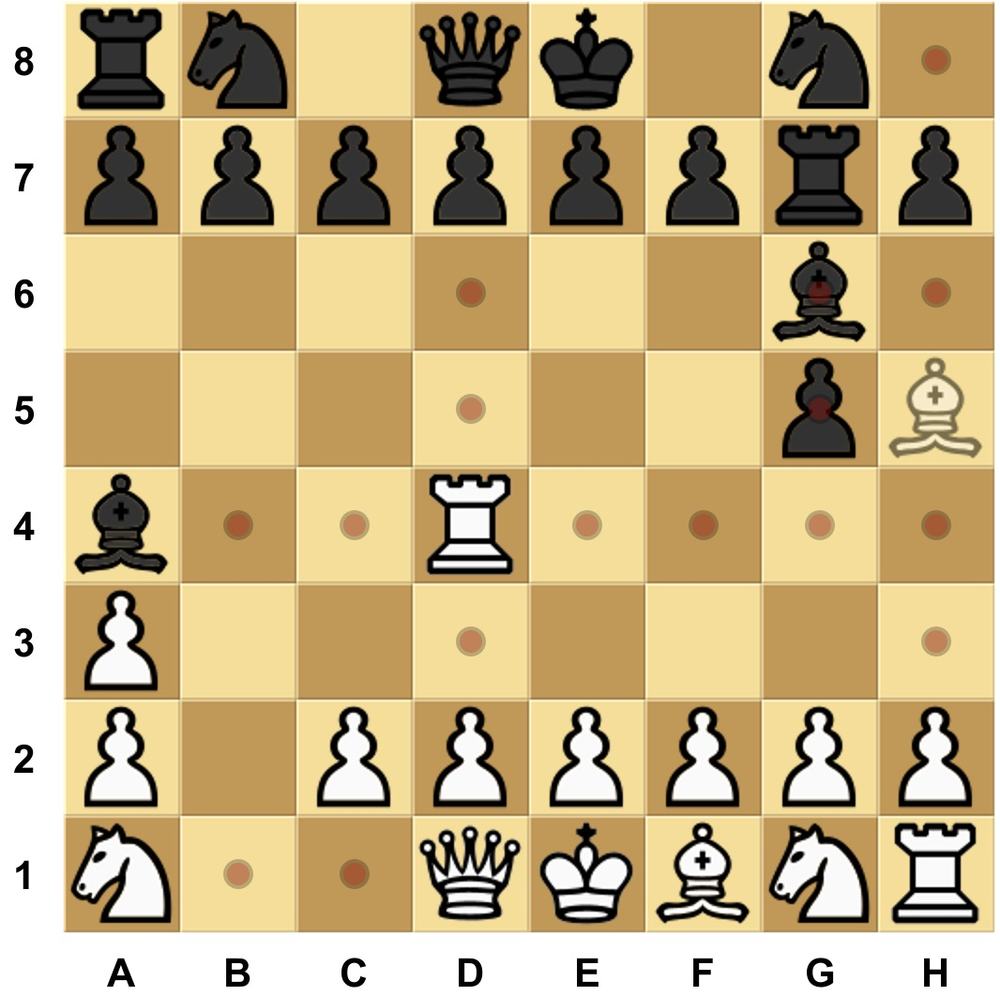

# Modern Warfare Chess (MWChess):   A Modern-Warfare-Themed Chess Variant

This document presents a newly designed chess variant—Modern Warfare Chess (MWChess)—which seeks to move beyond the medieval battlefield narrative traditionally associated with standard chess, and instead reflect the complexities of modern military systems and geopolitical dynamics. In this setting, players no longer assume the roles of kings or feudal commanders, but rather command modern combat units, firepower delivery systems, strategic deployments, and logistical support networks. At the same time, non-conventional elements such as political maneuvering, information control, and territorial influence are integrated into the game mechanics.

MWChess is designed to be accessible even to those unfamiliar with classical chess rules, offering a standalone system that can be learned and played independently. Its core philosophy is to retain certain classical structural elements while reimagining the game through the lens of 21st-century strategic thinking. By doing so, it aims to inspire deeper reflection on the evolving nature of warfare, decision-making, and competitive interaction in modern contexts.

---

## Table of Contents
- [1. Design Objectives of MWChess](#1-design-objectives-of-mwchess)
- [2. Board and Initial Setup](#2-board-and-initial-setup)
- [3. Piece Rules and Symbolism](#3-piece-rules-and-symbolism)
  - [3.1 King](#31-king)
  - [3.2 Pawn](#32-pawn)
  - [3.3 Rook](#33-rook)
  - [3.4 Bishop](#34-bishop)
  - [3.5 Knight](#35-knight)
  - [3.1 Queen](#36-queen)
- [4. Victory Conditions](#4-victory-conditions)
- [5. Strategic Guidelines](#5-strategic-guidelines)

---

## 1. Design Objectives of MWChess

The core philosophy behind MWChess is to retain the foundational framework of classical chess while integrating strategic concepts and political dynamics reflective of modern warfare. The game seeks to abstract key characteristics of contemporary military confrontation at both the rule and mechanic levels, encouraging players to develop a systematic understanding of modern conflict and strategic interplay. The specific design goals are as follows:

- ### Retaining the Standard Chessboard and Piece Set

    MWChess uses the same 8×8 board and standard piece types as classical chess, requiring no additional components or specialized equipment. This design choice lowers the entry barrier for new players and enhances the game’s accessibility and ease of dissemination. Anyone with a standard chess set can immediately engage with MWChess, greatly facilitating the adoption and popularization of the variant.

- ### Preserving Rule Simplicity with Strategic Depth

    MWChess aims to match classical chess in terms of rule complexity—offering clear and intuitive gameplay that is easy to learn, yet rich in strategic potential. While the core rules are straightforward for beginners to grasp, the game retains tactical richness in areas such as unit coordination, operational planning, and non-military strategic contest. This “easy to learn, hard to master” structure ensures long-term replayability and competitive value.

- ### Delivering a Fast-Paced Competitive Experience

    MWChess preserves the extended mobility of certain pieces from classical chess, allowing them to access diverse positions and attack routes right from the opening phase. This design enhances tactical diversity and strategic unpredictability, while also accelerating the transition into the intense middlegame battles.

- ### Maintaining a Tactile and Intuitive Player Experience

    The classic chess capture mechanic—moving one’s own piece onto the square occupied by an opponent’s piece and removing the captured piece from the board—provides a direct, tangible, and even somewhat “viscerally aesthetic” sense of interaction, which is one of the reasons for its enduring popularity. Although the game background of MWChess is modern warfare, dominated by firearms, the design deliberately retains the mechanic of “entering the target square to directly eliminate the opposing piece” without implementing any remote capture mechanisms. This choice both preserves the intuitive feel of classic chess moves and ensures the visual appeal and tactile experience of the gameplay.

- ### Abstracting Key Features of Modern Warfare

    Unlike ancient formations engaging in frontal battles, modern warfare emphasizes synergy, specialization, and multidimensional operations. Beyond conventional armored clashes and ammunition exchanges, the modern battlefield also features “C4ISR-firepower integration” (Command, Control, Communications, Computers, Intelligence, Surveillance, and Reconnaissance), offering new dimensions of tactical impact. Furthermore, political influence and strategic signaling often shape the broader trajectory of conflict. MWChess seeks to abstract these features and integrate them meaningfully into the game mechanics, with the broader ambition of serving as a tool for military education and public understanding of defense-related concepts.

---

## 2. Board and Initial Setup

The board size, piece types, and initial setup in MWChess are fully identical to those of classical chess.

Each side—White and Black—has the following set of pieces:
- 8 ***Pawns***
- 2 ***Rooks***
- 2 ***Knights***
- 2 ***Bishops***
- 1 ***Queen***
- 1 ***King***

White’s initial setup:
- ***Pawns*** on ***a2*** through ***h2***
- ***Rooks*** on ***a1*** and ***h1***
- ***Knights*** on ***b1*** and ***g1***
- ***Bishops*** on ***c1*** and ***f1***
- ***Queen*** on ***d1***
- ***King*** on ***e1***

Black’s initial setup:
- ***Pawns*** on ***a7*** through ***h7***
- ***Rooks*** on ***a8*** and ***h8***
- ***Knights*** on ***b8*** and ***g8***
- ***Bishops*** on ***c8*** and ***f8***
- ***Queen*** on ***d8***
- ***King*** on ***e8***

As illustrated:

---

## 3. Piece Rules and Symbolism

### 3.1 ***King***
  #### Movement Rules:
  - The ***king*** may move one square in any direction—forward, backward, sideways, or diagonally.
  
  - If the destination square is occupied by an enemy piece, it captures that enemy piece and occupies the square.
  
  - The king ***cannot*** be sacrificed: no move is permitted if it results in the ***king*** being in a position where it could be captured (i.e., a ***checked*** state).

  #### Example:
  
  In the figure below, the white ***king*** located on ***f4*** can move to any of the highlighted squares and can capture the black ***rook*** on ***e5***, but cannot move to ***f5*** or ***g5*** as those squares are under threat from the black ***king*** on ***g6***.
  
  

  
  

  #### Symbolism:
  In MWChess, the ***king*** represents not only the supreme commander but also the final line of defense and the core will of a faction. Its safety directly determines the outcome of the entire war.

### 3.2 ***Pawn***
  #### Movement Rules:
  - A ***pawn*** may move one square in any of the following directions: forward, forward-left, forward-right, left, or right. It ***cannot*** move backward, backward-left, or backward-right.
  
  - If the destination square is occupied by an enemy piece, it captures that enemy piece and occupies the square.
  
  - ***Initial Move Rule***: On its first move, A ***pawn*** may move forward by two adjacent squares in a straight line, without skipping or jumping over any square in any of the permitted directions (forward, forward-left, forward-right, left, or right). This extended move ***cannot*** be used to capture.
  
  - ***Suppression Rule***: A ***pawn*** may ***only*** be captured by an enemy piece when it is ***suppressed***, meaning there are at least two enemy pieces within the eight adjacent squares surrounding the ***pawn***.
  
  #### Example:
  
  In the figure below, the white ***pawn*** on ***f2*** is on its initial square, so it may advance one or two squares along allowed files, reaching any highlighted square (e.g., ***d2*** or ***h2***). The ***pawn*** can capture the black ***pawn*** on ***f3***, which is suppressed by the white ***pawns*** on ***e4*** and ***f2***, but cannot capture the black ***pawn*** on ***g3*** as it is not suppressed. Although the black ***pawn*** on ***d4*** is suppressed by white ***pawns*** on ***c4*** and ***e4***, the white ***pawn*** on ***f2*** cannot capture it because ***pawns*** cannot capture when making a two-square initial advance.
  
  

  
  

  #### Symbolism:
  ***Pawns*** represent frontline combat units in modern warfare, offering high mobility and strong area control. Compared to traditional chess, MWChess ***pawns*** are more powerful and serve as the backbone of a faction’s strategic execution. The suppression rule reflects the survivability of mainline troops when not under concentrated fire.
  
### 3.3 ***Rook***
  #### Movement Rules:
  - A ***rook*** may move any number of squares in a straight line along the four diagonal directions: forward-left, forward-right, backward-left, and backward-right, as long as the path is unobstructed.
  
  - ***Rooks*** ***cannot*** capture by movement; they may only move to unoccupied squares.
  
  - The movement of friendly ***Bishops*** depends on the position of ***rooks***; a ***bishop*** may be moved to any square in the same ***rank*** or ***file*** as a friendly ***rook***.
  
  #### Example:
  
  In the figure below, the white ***rook*** on ***d4*** can move diagonally to any highlighted square. Since rooks cannot capture, the black ***king*** was able to safely move from ***b7*** to ***b6*** in the previous move.
  
  

  
  

  #### Symbolism:
  - The ***rook*** symbolizes electronic reconnaissance and support systems in modern warfare, such as radar, satellites, and communication nodes. While they lack offensive capability, they are critical to decision-making and strike coordination. Their high mobility and inability to capture highlight the covert and non-combat nature of such systems.  

### 3.4 ***Bishop***
  #### Movement Rules:
  - A ***bishop*** has two distinct abilities:

    - It may be moved to any empty square in the same ***rank*** or ***file*** as any friendly ***rook***.
    
    - It may capture any enemy piece in one of the eight adjacent squares, replacing it on that square.

  - ***Bishops*** ***cannot*** be captured.

  - A ***bishop***’s capturing ability is not subject to the suppression requirement for ***pawns***, nor are ***bishops*** immune to captures by ***bishops***. For example, a ***bishop*** may capture an enemy ***bishop*** or a ***pawn*** that is not under suppression.

  #### Example:
  
  In the figure below, the movement of the white ***bishops*** on ***h5*** and ***c1*** is constrained by the ranks and files controlled by the white ***rooks*** on ***e4*** and ***h1***, allowing the ***bishops*** to move to any highlighted square. Additionally, the ***bishop*** on ***h5*** can capture the black ***bishop*** on ***g6*** and the un-suppressed black ***pawn*** on ***g5***, moving into their squares.
  
  

  
  

  #### Symbolism:
  - ***Bishops*** represent long-range strike forces such as air and space-based precision weaponry. Their effectiveness depends on ground-based targeting and reconnaissance (i.e., the ***rooks***), embodying the integrated “ISR-strike” model of modern combat. The rule that ***bishops*** cannot be captured reflects the often irreversible nature of aerial strikes once launched.

### 3.5 ***Knight***
  #### Movement Rules:
  - A ***knight*** may move any number of squares in a straight line along the four orthogonal directions: forward, backward, left, or right, as long as the path is unobstructed.
  
  - If the destination square is occupied by an enemy piece, it may capture and occupy that square.

  - A ***knight***’s capturing ability is not subject to the suppression requirement for ***pawns***, nor are ***bishops*** immune to captures by ***knights***. For example, a ***knight*** may capture an enemy ***bishop*** or a ***pawn*** that is not under suppression.

  - (Note: This movement rule corresponds to the ***rook*** in classical chess. The name “knight” is retained for symbolic reasons.)
  
  #### Example:
  
  In the figure below, the white ***knight*** on ***e4*** can move to any highlighted square along horizontal and vertical directions. It can capture the black ***bishop*** on ***h4*** and the un-suppressed black ***pawn*** on ***e6***. Furthermore, if the ***knight*** captures the ***pawn*** on ***e6***, it puts the black ***king*** on ***e8*** in check.
  
  

  
  

  #### Symbolism:
  - ***Knights*** represent special operations forces in modern warfare—highly mobile and capable of delivering decisive strikes. They can eliminate frontline units, long-range strike platforms, and even strategic-level political assets, reflecting their precision and versatility.

### 3.6 ***Queen***
  #### Movement Rules:
  - The ***queen*** may move any number of squares in a straight line in any direction—orthogonal or diagonal—provided the path is unobstructed.
  - The ***queen*** ***cannot*** capture by movement; it may only move to unoccupied squares.
  - It plays a special role in the victory conditions: if a player’s ***queen*** successfully reaches any square on the opponent’s back rank (the ***1st*** rank for White, the ***8th*** rank for Black), that player immediately wins the game.

  #### Example:
  
  In the figure below, the white ***queen*** on ***c4*** can move to any highlighted square. Notably, if the ***queen*** moves to ***g8*** (black’s back rank, ***8th*** rank), white wins the game.
  
  

  
  

  #### Symbolism:
  The ***queen*** symbolizes non-military strategic power—such as politics, diplomacy, and media influence. While not directly involved in battlefield operations, it plays a decisive role in the overarching strategic framework. Its unrestricted movement reflects the flexibility and broad reach of political influence across multiple domains.

---

## 4. Victory Conditions

### ***Checkmate***

If a player makes a move that places the opponent’s ***king*** in check, and the opponent cannot make any legal move on their next turn to remove the ***king*** from check, the player delivering the checkmate wins the game.

### ***PoliWin*** (Queen Reaches Back Rank)

If a player’s ***queen*** successfully reaches any square on the opponent’s back rank (the ***1st*** rank for White, the ***8th*** rank for Black), that player immediately wins the game.

### ***Draw***
  - A draw may be offered by one player and accepted by the other.
  - If a player has no legal move and their ***king*** is not in check, the game ends in a ***stalemate***, resulting in a draw.
  - If the same position occurs three times, with the same player to move and the same possible legal moves each time, the game ends in a ***threefold*** repetition, resulting in a draw.
  - If both players make 50 consecutive moves without any ***capture***, the game ends in a draw.

### Special Notes

***PoliWin*** takes lower priority than ***Check*** and ***Checkmate***.  

Even if your next move could achieve ***PoliWin*** by moving the ***queen*** to the opponent's back rank, you must first respond to a ***Check*** if your ***king*** was checked in the opponent's previous turn. If it is ***Checkmate***, the opponent wins immediately.

In the figure below, although the black ***queen*** on ***e8*** could achieve a ***PoliWin*** victory by moving to ***e1*** (white’s back rank, ***1st*** rank), the black side must respond to the check on the black ***king*** on ***f6*** caused by the white ***pawn*** ’s previous move from ***g4*** to ***f5***. Therefore, black must first address the check by either capturing the suppressed white ***pawn*** on ***f5*** with the black ***pawn*** on ***g5*** or the black ***king*** on ***f6***, or by moving the black ***king*** to ***e7*** to escape the check.

---

## 5. Strategic Guidelines

- ***King***

  The ***king*** possesses actual combat capability. Therefore, in the mid-to-late stages of the game, it should not remain purely defensive. When the situation allows, the ***king*** can advance proactively to exert pressure on the opponent’s formation.

- ***Pawn***

  ***Pawns*** offer strong control and resilience, making them ideal for stabilizing the frontline and midboard. However, as ***pawns*** cannot retreat and become increasingly constrained near the enemy back rank, players should avoid advancing them too early or too deep into enemy territory.

- ***Rook***

  The ***rook*** determines the ***bishop***’s movement range. Effective use of its long-range mobility allows for strategic positioning of ***bishops*** on key squares. However, ***rooks*** cannot capture and lack self-defense, so they should avoid overextension or isolation behind enemy lines.

- ***Bishop***

  Although a ***bishop***’s movement is heavily dependent on the ***rook***’s position, it can also move by capturing. Players should stay alert for opportunities to use enemy pieces as stepping stones, enabling ***bishops*** to reposition unexpectedly and pose threats from new angles, instead of being isolated on the board and unable to move, after both ***rooks*** have been captured.

- ***Knight***

  The ***knight*** holds high strategic value, as it is not subject to the ***pawns*** must be suppressed to be captured rule, and enemy ***bishops*** are not immune to ***Knight*** attacks. ***Knights*** should be actively developed in the early and middlegame, especially when seeking to suppress the opponent’s ***queen*** or ***bishops***.

- ***Queen***

  While the ***queen*** cannot capture, it has powerful mobility and decisive influence over the game’s outcome. It should be carefully preserved during the early game and positioned in the mid-to-late game to strike at victory via PoliWin. Eliminating the opponent’s ***queen*** is also a key strategic objective, enabling control of tempo and long-term advantage.

---

© 2025 by the original author.  
This ruleset is licensed under the Creative Commons Attribution-NonCommercial 4.0 International License.  
You may redistribute and modify this file with proper attribution, but you may not use it commercially.  
License: https://creativecommons.org/licenses/by-nc/4.0/
